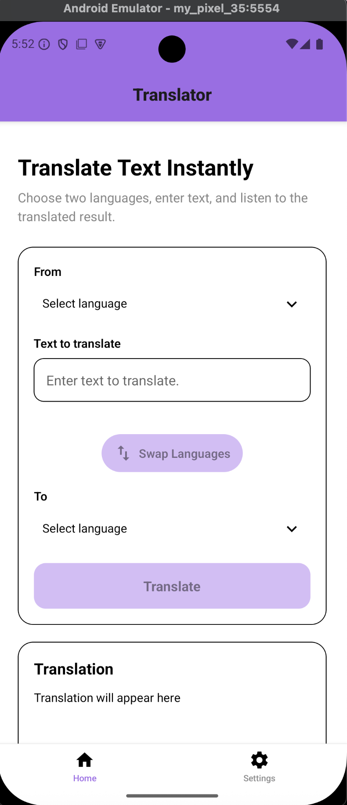
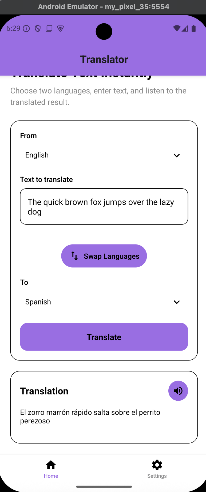
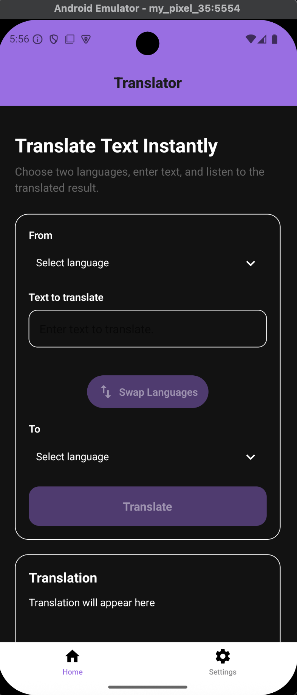
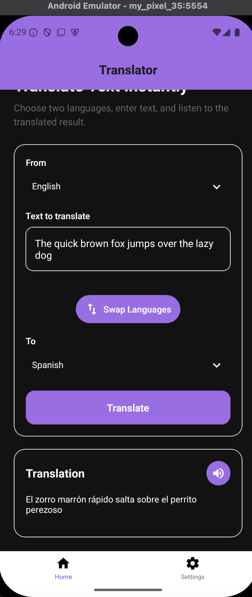

# Mobile Translator Application

## Project Overview
This repository contains the code for a cross-platform mobile translation application built with React Native and Expo that provides multilingual text translation and text-to-speech playback using Dockerized LibreTranslate and OpenTTS services.

The application allows users to:

- Translate text between supported languages
- Listen to translated text using text-to-speech
- Swap source and target languages
- Switch between light and dark themes

The application was developed with Expo and is designed to run locally using Docker. See Getting Started for more details on starting this application.

## Features
- Text-to-text translation using LibreTranslate
- Text-to-speech playback using OpenTTS
- Dynamic language selection
- Source/target language swapping
- Light and dark themes
- Responsive React Native interface

## Demo

### Light Mode

<p align="center">
  
  
</p>

### Dark Mode

<p align="center">
  
  
</p>

## Tech Stack
- React Native
- Expo
- TypeScript
- Docker
- LibreTranslate
- OpenTTS
- React Context API

## Architecture

The application follows a client-service architecture.

- React Native + Expo provide the mobile user interface.
- LibreTranslate performs multilingual text translation.
- OpenTTS generates speech for translated text.
- Docker Compose hosts both services locally.
- React Context manages application theme state.

## Project Structure

```text
translator-app/
|-- components/
|-- contexts/
|-- data/
|-- lib/
|-- src/
|-- Docker/
```

## Getting Started

### Prerequisites

Before running the application, ensure the following software is installed:

- Node.js (includes npm)
- Docker Desktop
- Android Studio (Android Emulator) or a physical Android device
- Expo Go (if using a physical device)

Verify your installation by running:

```bash
node -v
npm -v
docker -v
```

If you don't have Node.js installed, install it [here](https://nodejs.org/en). This should automatically install npm as well.

If you don't have Docker installed, install it [here](https://www.docker.com/get-started/).

### Installation

Clone the repository:

```bash
git clone https://github.com/sarambos/Mobile-Translator-App.git
cd Mobile-Translator-App
```

Then, install the project dependencies:

```bash
cd translator-app
npm install
```

### Running the Translation Services
The application relies on two locally hosted services:

- **LibreTranslate** – performs multilingual text translation.
- **OpenTTS** – generates spoken audio for translated text.

Both services are provided through Docker Compose.

Navigate to the Docker directory:

```bash
cd src/Docker
```

Next, start the containers:

```bash
docker compose up -d
```

or, if you're using an older Docker version:

```bash
docker-compose up -d
```

Once the containers have started successfully:

- LibreTranslate will be available on port 5001
- OpenTTS will be available on port 5500

Note: These services **must** remain running while using the application.

### Starting the application

Return to the project directory:

```bash
cd translator-app
```

Start the the Expo development server:

```bash
npx expo start
```

This launches Metro and displays a QR code (for physical devices) along with connection options for Android emulators.

### Running the Android Emulator

Start an Android Virtual Device (AVD) from Android Studio or using:

```bash
emulator -avd <EMULATOR_NAME>
```

Once the emulator is running:
1. Open Expo Go
2. Select **Enter URL**
3. Copy the Metro URL from the terminal
4. Paste the URL into Expo Go
5. The application will launch automatically

### Running on a Physical Device

1. Install Expo Go from the App Store or Google Play
2. Ensure your phone and development machine are connected to the same network
3. Scan the QR code generated by Expo.

### Troubleshooting

#### Docker containers are not running

Verify both services are active:

```bash
docker ps
```

Restart the containers if necessary:

```bash
docker compose up -d
```

or, if you have an older Docker version:

```bash
docker-compose up -d
```

#### Expo cannot connect

- Verify your device and computer are on the same network
- Confirm the Docker services are running
- Restart the Expo development server

#### Translation fails

Confirm LibreTranslate is running on port **5001**.

#### Audio playback fails

Text-to-speech currently supports Android devices only. Ensure OpenTTS is running on port **5500**.

## Future Improvements
- Speech-to-speech Translation
- Speech recognition for voice input
- Translation history
- Favorite Languages
- Offline translation support
- User preferences and settings

## Lessons Learned

This project strengthened my experience with:

- React Native application architecture
- TypeScript
- REST API integration
- Dockerized development environments
- Asynchronous programming
- React Context state management